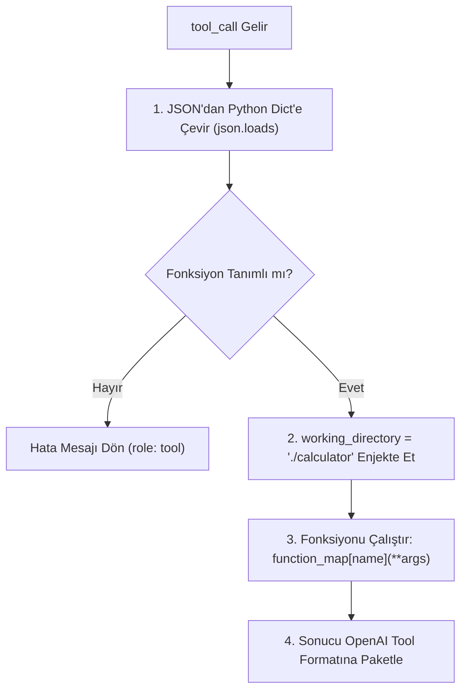

# AI Agent Mimarisi ve Yapılan Geliştirmeler

Bu doküman, bu gece üzerinde çalıştığımız **Function Calling**, **ReAct Agent Loop** ve **Git Hijyeni** konularının derinlemesine bir özetidir. Yatağa geçip rahatça okuyabileceğin şekilde, adım adım ve temel mantığıyla derlendi.

---

## 1. Büyük Resim: Chatbot vs. AI Agent

Bir LLM (Büyük Dil Modeli) tek başına sadece bir **metin tamamlama motorudur**. Bir metin verirsin, olasılıklara göre en uygun cevabı yazar. Dosya sistemi göremez, kod çalıştıramaz, internete çıkamaz.

* **Klasik Chatbot:** Kullanıcı sorar -> LLM bildiği kadarıyla cevaplar.
* **AI Agent (Ajan):** Kullanıcı bir hedef verir -> LLM bir plan yapar, ortamı gözlemler, bilgisayardaki araçları (fonksiyonları) kullanır, araçların çıktısına göre planını günceller ve hedef tamamlanana kadar **kendi kendine döngüde çalışır**.

---

## 2. Aşama 1: Fonksiyon Yürütücüsü (`call_function.py`)

### Problem ve İhtiyaç
Model bir önceki derste fonksiyon çağırma niyetini belirtebiliyordu (`tool_calls`). Ancak Python tarafında bu çağrıyı yakalayıp gerçek bir koda dönüştüren mekanizma yoktu.

```
[LLM] --(JSON Talebi: "tests.py'yi çalıştır")--> [main.py] --?--> (Fonksiyon çalışmıyordu)
```

### Çözüm: Dispatcher (Dağıtıcı) Deseni

`functions/call_function.py` dosyasında yazdığımız `call_function` fonksiyonu bir köprü vazifesi görür:



### Kritik Teknik Detaylar:

1. **Argüman Parsing:**
   LLM argümanları sözlük olarak değil, JSON stringi olarak iletir (`'{"file_path": "lorem.txt"}'`). Bunu `json.loads(arguments or "{}")` ile güvenli şekilde ayrıştırdık.

2. **Sandbox & Güvenlik Enjeksiyonu:**
   LLM'e çalışma dizini parametresini bırakmadık. Eğer bıraksaydık prompt injection ile `working_directory="/etc"` gibi izin verilmeyen yerleri okumaya çalışabilirdi. Bu yüzden içeride kod seviyesinde:
   ```python
   function_args["working_directory"] = "./calculator"
   ```
   ataması yaptık.

3. **OpenAI Standart Yanıt Formatı:**
   LLM'e fonksiyon sonucunu dönerken modelin bunu anlayabilmesi için tam olarak şu sözlük formatı gereklidir:
   ```python
   {
       "role": "tool",
       "tool_call_id": tool_call.id,  # LLM hangi isteğin cevabı olduğunu buradan anlar
       "content": result,              # String formatında fonksiyon çıktısı
   }
   ```

---

## 3. Aşama 2: Agent Loop (ReAct / Geri Bildirim Döngüsü)

Ajanı "ajan" yapan kalptir. Tek seferlik soru-cevap yerine, model bir sonuca ulaşana kadar çalışan bir geri bildirim mekanizması kurduk.

### ReAct (Reason + Act) Döngüsü

```mermaid
sequenceDiagram
    autonumber
    actor User as Kullanıcı
    participant Main as main.py (Agent Loop)
    participant LLM as OpenRouter LLM
    participant Tool as Python Fonksiyonları

    User->>Main: "Hesap makinesi konsola nasıl çıktı basıyor?"
    loop En Fazla 20 Tur
        Main->>LLM: Mesaj Geçmişi (messages)
        alt Model Tool Çağırmak İstiyor (Reasoning)
            LLM-->>Main: assistant (tool_calls: [get_files_info])
            Main->>Main: messages.append(assistant_mesajı)
            Main->>Tool: get_files_info() çağrılır
            Tool-->>Main: Dosya listesi döner
            Main->>Main: messages.append(tool_mesajı)
            Note over Main,LLM: Döngü başa döner; LLM artık dosya listesini görüyor!
        else Model Nihai Cevap Üretti (İş Bitti)
            LLM-->>Main: assistant (content: "Hesap makinesi main.py içinde...")
            Main->>User: Nihai Cevabı Yazdır
            Note over Main: Döngüden çık (Break/Return)
        end
    end
```

### Bu Döngüde Neleri Çözdük?

1. **Durum Yönetimi (Stateful Memory):**
   Her turda modelin önceki söylediği (`assistant`) ve ortamdan aldığı (`tool`) tüm mesajları `messages` listesine ekledik. Böylece model bir önceki adımda ne yaptığını unutmadı.

2. **Kritik Sıralama Kuralı:**
   OpenAI API kuralıdır:
   * Önce asistanın `tool_calls` içeren mesajı eklenmelidir.
   * Hemen ardından o çağrıların id'leri ile eşleşen `role: tool` mesajları gelmelidir.
   * Bu sıra bozulursa API `400 Bad Request` hatası fırlatır.

3. **Sonsuz Döngü Koruması (Guardrail):**
   Eğer model takılırsa veya saçmalarsa sonsuz döngüye girip bakiyeni tüketmesin diye `for _ in range(20):` sınırı koyduk. 20 turda biterse program `sys.exit(1)` ile duruyor.

4. **Sistem Promptu Mühendisliği:**
   İlk denemede model dosyaları listeledikten sonra duruyordu. Çünkü eski sistem promptunda sadece `List files and directories` yazılıydı. Promptu:
   * Dosyaları listeleme
   * Dosya içeriği okuma
   * Python çalıştırma
   * Dosya yazma
   yeteneklerini bildirecek şekilde güncelledik. Model bunu görünce `get_files_info` ardından otomatik olarak `get_file_content` çağırarak `main.py` ve `render.py` dosyalarını inceledi ve mükemmel bir açıklama üretti.

---

## 4. Aşama 3: Git & Güvenlik Hijyeni

Projeyi GitHub'a yüklerken yapılan kritik adımlar:

* **API Key Güvenliği (`.env`):**
  `.env` içinde `OPENROUTER_API_KEY` anahtarın mevcuttu. Bu dosya GitHub'a giderse dakikalar içinde botlar tarafından taranır ve key iptal edilir / bakiye boşaltılır.
* **`.gitignore` Güçlendirildi:**
  `.env`, `__pycache__/`, `*.pyc`, `.venv/`, `.idea/`, `.vscode/`, `.DS_Store` kuralları eklendi.
* **`git rm --cached` ile Eski Takip Edilenlerin Temizlenmesi:**
  Git index'indeki `.DS_Store`, `.idea/` ve `__pycache__` dosyaları diskten silinmeden `git rm -r --cached` ile git hafızasından çıkarıldı.
* **GitHub Yayını:**
  `pumanator/ai-agent` adında yeni bir public repo açıldı ve kodlar pushlandı:
  🔗 https://github.com/pumanator/ai-agent

---

## 5. Kısa Özet (Yatmadan Önce Akılda Kalacak 3 Cümle)

1. **LLM fonksiyon çalıştırmaz;** sadece hangi fonksiyonu istediğini söyler, fonksiyonu senin Python kodun çalıştırır ve sonucu geri besler.
2. **Ajan,** `Düşün (LLM) -> Eylem Yap (Tool) -> Sonucu Gör (Gözlem)` adımlarını bir hedef tamamlanana kadar döngü içinde işleten yapıdır.
3. **`.env` ve önbellek dosyaları** asla Git'e gitmemelidir; gitmişse de `git rm --cached` ile temizlenmelidir.

İyi uykular! 😴
